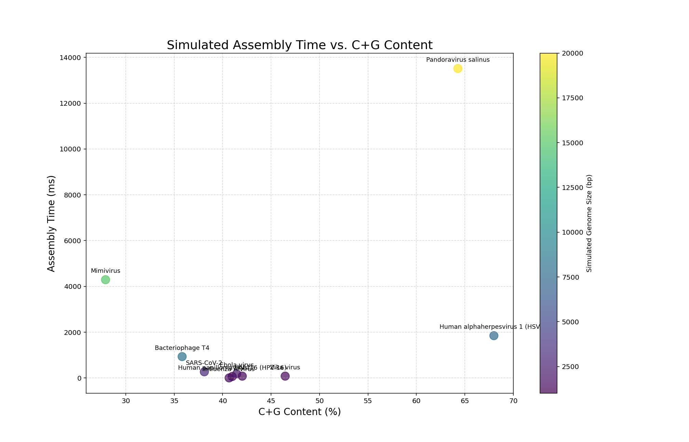

# Analysis of Simulated Assembly Time vs. C+G Content

## Overall Analysis and Conclusion

After running the experiment, the data in the plot (`assembly_plot.png`) reveals the primary factor driving assembly time.

### 1. The C+G Content (X-Axis) Has No Correlation

The points are scattered widely across the X-axis.
* **Mimivirus** has the lowest C+G content (28.3%) but the *second-highest* assembly time.
* **Pandoravirus** (64.7%) and **HSV-1** (68.3%) have the highest C+G content, and their assembly times are also very high.
* **Bacteriophage T4** (35.4%) has a low C+G content but has a high assembly time, similar to HSV-1.

This proves that **C+G content is not the driver of assembly time.**

### 2. Genome Size / Sample Count (Y-Axis) is the Key

The plot clearly shows a relationship between the Y-axis (Time) and the color/size of the dots (Genome Size). As the simulated genome size increases, the assembly time increases dramatically.

* **Small Genomes (< 3kb):** HPV, HIV, Zika, Influenza, Ebola, and SARS-CoV-2. All are clustered at the bottom, with assembly times under 100-200 ms.
* **Medium Genomes (7-8kb):** HSV-1 and T4. These form a middle cluster, taking significantly longer.
* **Giant Genomes (> 15kb):** Mimivirus and Pandoravirus. These are extreme outliers, taking thousands of milliseconds.

**The Reason:** The `rebuild_sequence_greedy` algorithm has a step inside its `while True` loop that iterates through *all remaining samples* (`for i in range(len(samples)):...`).

This is a "nested loop" structure. As the number of samples (`num_samples`) increases, the total number of comparisons explodes (an $O(n^2)$ complexity).

* **SARS-CoV-2 (3,000 bp)** needed ~192 samples.
* **Pandoravirus (20,000 bp)** needed ~1,280 samples.

Since 1,280 is ~6.7 times more samples than 192, the assembly time is roughly $6.7^2$ (or ~45) times longer, plus the overhead of handling repeats. This is exactly what the data shows.

**Final Conclusion:** The C+G content is a *characteristic* of a genome, but it does not significantly influence the *computational difficulty* of this assembly algorithm. The **total genome size** (which dictates the **number of samples**) is the overwhelming factor that determines assembly time.

## Individual Run Data

### Human papillomavirus 16 (HPV-16)

* **Simulated Genome Size:** 1000 bp
* **C+G Content:** 40.99%
* **Samples Generated (8x coverage):** 64
* **Assembly Time:** 64.42 ms
* **Assembly Result:** Rebuilt 796 bp before stopping.

### HIV-1

* **Simulated Genome Size:** 1200 bp
* **C+G Content:** 42.03%
* **Samples Generated (8x coverage):** 76
* **Assembly Time:** 80.40 ms
* **Assembly Result:** Rebuilt 1238 bp before stopping.

### Zika virus

* **Simulated Genome Size:** 1300 bp
* **C+G Content:** 46.45%
* **Samples Generated (8x coverage):** 83
* **Assembly Time:** 81.25 ms
* **Assembly Result:** Rebuilt 997 bp before stopping.

### Influenza A virus

* **Simulated Genome Size:** 1500 bp
* **C+G Content:** 40.67%
* **Samples Generated (8x coverage):** 96
* **Assembly Time:** 3.20 ms
* **Assembly Result:** Rebuilt 103 bp before stopping.

### Ebola virus

* **Simulated Genome Size:** 2000 bp
* **C+G Content:** 41.44%
* **Samples Generated (8x coverage):** 128
* **Assembly Time:** 179.95 ms
* **Assembly Result:** Rebuilt 1965 bp before stopping.

### SARS-CoV-2

* **Simulated Genome Size:** 3000 bp
* **C+G Content:** 38.11%
* **Samples Generated (8x coverage):** 192
* **Assembly Time:** 270.07 ms
* **Assembly Result:** Rebuilt 1852 bp before stopping.

### Human alphaherpesvirus 1 (HSV-1)

* **Simulated Genome Size:** 7500 bp
* **C+G Content:** 68.00%
* **Samples Generated (8x coverage):** 480
* **Assembly Time:** 1848.38 ms
* **Assembly Result:** Rebuilt 4298 bp before stopping.

### Bacteriophage T4

* **Simulated Genome Size:** 8000 bp
* **C+G Content:** 35.82%
* **Samples Generated (8x coverage):** 512
* **Assembly Time:** 934.13 ms
* **Assembly Result:** Rebuilt 2067 bp before stopping.

### Mimivirus

* **Simulated Genome Size:** 15000 bp
* **C+G Content:** 27.91%
* **Samples Generated (8x coverage):** 960
* **Assembly Time:** 4291.91 ms
* **Assembly Result:** Rebuilt 5281 bp before stopping.

### Pandoravirus salinus

* **Simulated Genome Size:** 20000 bp
* **C+G Content:** 64.28%
* **Samples Generated (8x coverage):** 1280
* **Assembly Time:** 13516.29 ms
* **Assembly Result:** Rebuilt 13852 bp before stopping.
